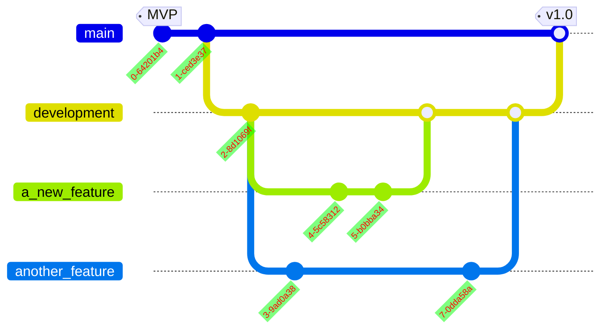
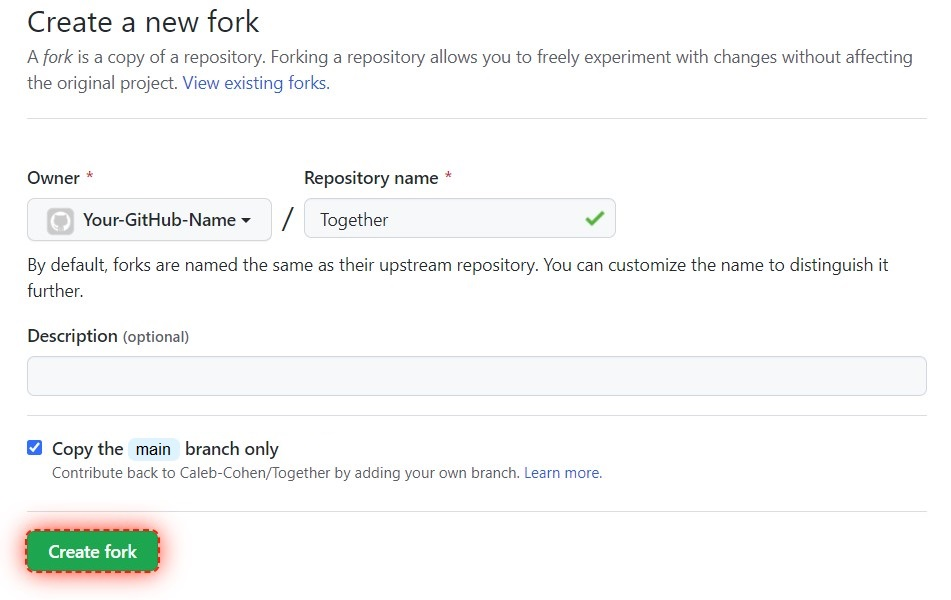
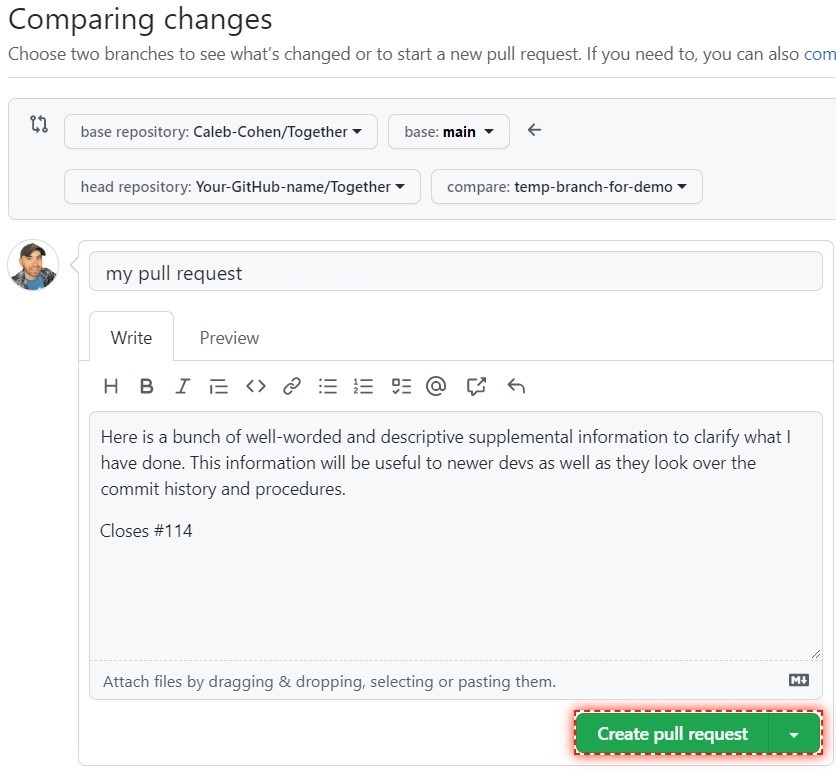
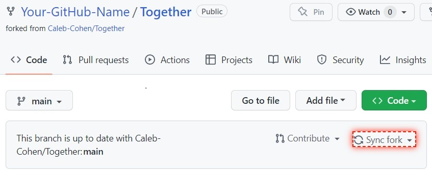

# How to contribute

Welcome to this Beginner-friendly instructional guide for individual contributors and team members working on the Together project!

## Table of contents

1. [How to get involved](#how-to-get-involved)
2. [Prequisites](#prerequisites)
3. [Together GitFlow structure](#together-gitflow-structure)
4. [Finding issues to work on](#issues)
5. [Editing code and submitting a pull request](#editing-code-and-submitting-a-pull-request)

## How to get involved

> Guess what! If you are already a member of 100Devs, one of us can personally walk you through all the steps you will need to contribute code to this project. Please send a message on Discord in the [Together discussion thread (external link)](https://discord.com/channels/735923219315425401/1038482732633825442). We will help you no matter what stage of learning you are on with whatever we can. We can assist you in looking for an issue to address, and if no issue exists that fits, we will create one. 🤠 

## Prerequisites
Anyone is welcome to join Together. If you're a beginner, we ask that you review the documents below before joining an issue. The React Scribma Course does not need to be completed, but having a basic understanding of React is heavily recommended. 

- [Git & GitHub Crash Course](https://www.youtube.com/watch?v=SWYqp7iY_Tc)
- [Completed Microsoft Introduction to Github](https://www.microsoft.com/en-us/dev-community/Event/Register?eventId=LearnwithLeonstream_ggNxpTZxIzb_&ocid=aid3038567)
- [Read the Contributing Documents](https://github.com/Caleb-Cohen/Together/blob/development/.github/CONTRIBUTING.md)
- [React Scrimba Course](https://scrimba.com/learn/learnreact)
## Together GitFlow Structure

This graph approximates the structure of the official repository and some example feature branches.  

>💡 (Don't be intimidated by this graph. It also confuses most of us.)

We are currently using a GitFlow-inspired workflow. GitFlow allows the production server to remain online and stable as contributors work on adding features and fixing bugs.

The `main` branch is for stable production code. This branch is the working version of the Together app. 

The `development` branch is a stable branch for testing code on the server before merging into main. `development` is also the default branch when forking the project.

Multiple `feature` branches can be checked out from the `development` branch. These `feature` branches are tied to various issues and are used to add new code. When ready, The `feature` branches are tested and merged into the `development` branch before the `development` branch is merged into `main.`

## Issues

Together's progress and milestones are split into separate, distinct issues. You are encouraged to request issues you feel will present you with a moderate challenge or that you have a strong interest in. Contributors can request assignments for each issue they wish to work on, and multiple contributors may be assigned to single issues. 

>💡 Issues tagged with `Good 100Devs First Try` are beginner-level issues that are great for fellow 100Devs.

There are two ways to discover issues.

### Issues Tab

The [Issues tab](https://github.com/Caleb-Cohen/Together/issues) contains all of the issues that are currently in progress, planned to be worked on, or need further review. 

### Projects Tab
  
---

A [project management board](https://github.com/users/Caleb-Cohen/projects/1) also exists for this project on GitHub. The project management board contains relevant issues to advance the project to the next milestone or release.

>Issues will also be created for any bugs discovered in the project. (Minor fixes and typos do not typically require an issue and can be corrected directly in a pull request with a detailed description.)

## Editing code and submitting a pull request

Use the following process to make changes after an issue has been assigned to you.

### Forking, cloning, editing, pushing.

#### Forking

1. Navigate to the Together project at https://github.com/Caleb-Cohen/Together.
2. Click Fork. [Difference between forking and cloning a repo](https://www.youtube.com/watch?v=6YQxkxw8nhE)

4. Click Create fork.  

>💡 Your new fork will include the `development` branch as the default branch.

#### Cloning your fork
Now that you have a personal fork of the project on GitHub, you will be able to clone the fork to your computer. These instructions will cover cloning using the HTTPS Personal access token method.

1. On GitHub, navigate to your fork of the Together repository.

2. Above the list of files, click  Code.  

3. Click the clipboard icon to copy the URL for the repository.  

4. Open a terminal on your system.

5. Navigate to the directory where you want to clone the files.

6. Type `git clone`, and then paste the URL you copied earlier. It will look like this, with your GitHub username instead of YOUR-USERNAME:

`$ git clone https://github.com/YOUR-USERNAME/Together`

7. Press Enter. A clone will be created on your local computer.

#### Branching

Now that you have the copy, you will need access to the feature branch related to your issue to create a local working branch to write your code.

1. Set upstream to track the remote repository containing the original repo. (Not just your fork.)  
`git remote add upstream https://github.com/Caleb-Cohen/Together.git`

2. Use this command to fetch the list of remote branches.  
`git fetch upstream`

3. Checkout the feature branch appropriate for the issue you are working on.  
`git checkout <branchname>`

  >💡 The error `error: pathspec '&lt;branchname&gt;' did not match any file(s) known to git` usually means you mistyped the branch name. Try again using auto tab completion to fill out the correct branch name.

  You now have the code and are in the correct feature branch, but before making changes to the project, you should create a new unique branch and check it out. This branch will exist on your local machine and be pushed to your fork on GitHub. Later you will be able to create a Pull Request with this branch.

4. Create and checkout a branch for the task you are working on.

   `git checkout -b a-descriptive-branch-name`

5. Make any changes, save your work, and make necessary commits.

   `git status` verify what has changed.

   `git add .` stage your files.

   `git commit -m "fixed a thingy"` perform the commit.

6. Push the changes to your fork on GitHub

   Typing `git push` will not work by itself but will show you what command you need to enter. An example shorthand of that command is 
   `git push -u origin a-descriptive-branch-name`
   Which will push the code from your origin (your local device) to the correct branch upstream (your GitHub fork.)

7. You must head back to GitHub.com to create a pull request.

#### Pull requests

1. Visit your fork on GitHub, and a new button should appear, allowing you to create the pull request

   

2. Write a description describing the changes you made, then click "Create pull request"

   

> 💡 You can link your PR back to the issue it addresses by mentioning the issue ID number in the description box. Include a "closing" keyword if your PR completely resolves the issue mentioned GitHub will automatically close the issue upon merging the PR.

3. A maintainer will review and test your changes and suggest edits if neccesary.

4. Once everything is good your code will be merged. 👍

<!-- 
Commented on these instructions for now. These may need to be reworded and restored or added to the wiki.

#### Merging pull requests

When there are open pull requests, team members can merge them into the repo. Try to get other team members to review and merge your code. They will be able to catch things you might have missed or make further requests or suggestions. The steps to merge code are below.

1. In the pull requests tab, click on the pull request you want to merge, and you will be brought to this screen.

   

1. Do not automatically merge requests. You can click on the various tabs at the top to see the commit messages and merge checks. The files changed tab will quickly show you everything that is changed line by line.

   

1. Once you are satisfied with all the changes, you can click "Merge pull request"

   

1. Do not get got. You also have to click "Confirm merge" to complete the pull request

    -->

#### Syncing your fork on GitHub

Keep your fork up to date after any pull requests are merged by clicking on "Sync fork" on your forked repository. This will help avoid merge conflicts the next time you submit a pull request.
