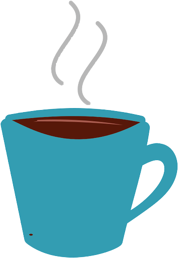
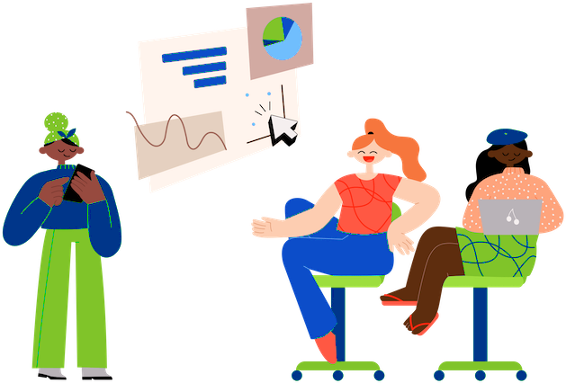

 
 

<h1 align="center">
  
</h1>

  Group calendar for public events, so you can see 
   
  what's going on in the 100Devs community!
   
   
  <a href="https://github.com/Caleb-Cohen/Together/wiki">Project Wiki</a>
  ·
  <a href="https://github.com/Caleb-Cohen/Together/blob/development/.github/CONTRIBUTING.md">Contributing guide</a>
  ·
  <a href="https://together.cyclic.app/"><strong>Link to project</strong></a>
  ·
  <a href="https://github.com/Caleb-Cohen/Together/issues">Request an issue</a>
  ·
  <a href="https://discord.com/channels/735923219315425401/1038482732633825442">Contact us!</a>

 
 

<table>
  <tr>
    <td valign="top" style="width:30%">
      

  
Table of Contents

  - [About](#-about)
    - [Built With](#-built-with)
  - [Getting Started](#-getting-started)
    - [Install](#-install)
  - [Contributions](#%EF%B8%8F-contributions)
  - [Acknowledgements](#-acknowledgements)

  

    </td>
    <td valign="top" style="width:70%"></td>
  </tr>
</table>

 
 

  

# 📢 About

Together is a new app designed for 100devs. Together is a group calendar for public events, so you can see what's going on in your community. We're making it easier to find out about the events that are happening in Discord and let you know how much fun they'll be!

 

  

## ✅ Built With

  <table>
    <tr>
      <td valign="center">
      
      
      </td>
      <td valign="center">
       
       
      </td>
      <td valign="center">
       
       
      </td>
    </tr>
  </table>

(<a href="#top">back to top</a>)

 

  

# 🚀 Getting Started
## 💻 Install

- Fork and clone the repository to your local computer.
- Complete and store `.env` file in the `server/config` folder
    - [(See .env template setup instructions)](https://github.com/Caleb-Cohen/Together/wiki/02---Onboarding#development-machine-setup)
- `npm install` in the root folder. installs the required dependencies.
- `npm run dev-concurrent` in the root folder. This starts the front-end and back-end in one terminal.
    - This runs a local instance of mongodb. You can connect to it by connecting to `mongodb://127.0.0.1:27017/` with any MongoDB client like [Compass](https://www.mongodb.com/products/compass).

 

### 🤔 <strong>Still having troubles?</strong>
You can check out our [New Developer Onboarding](https://github.com/Caleb-Cohen/Together/wiki/02---Onboarding) in our [wiki](https://github.com/Caleb-Cohen/Together/wiki).

You can also join the discussion in the [Together Discord channel](https://discord.com/channels/735923219315425401/1038482732633825442) within [100Devs](https://leonnoel.com/100devs/).

(<a href="#top">back to top</a>)

  

# 🛠️ Contributions

 ### Thanks go to these wonderful people for their contributions to <em>Together</em>:

  

 

## Help us improve Together!

<em>Together</em> is a community-driven open source project backed by 100devs students. Whether you are helping us fixing bugs, proposing new feature, improving our documentation or spreading the word - <strong>All contributions are welcome.</strong>

 

If you're interested in contributing, you may:
* read our [Contributing guide](.github/CONTRIBUTING.md);
* join our [Discord channel](https://discord.com/channels/735923219315425401/1038482732633825442) within 100Devs to discuss your ideas;
* Visit the [Issues tab](https://github.com/Caleb-Cohen/Together/issues) to request an issue or to open a new issue;
* You can also convert a "draft todo" to an issue on the [MVP Tasks Project Board.](https://github.com/users/Caleb-Cohen/projects/1/views/1)

(<a href="#top">back to top</a>)

  

# 📌 Acknowledgements

<table>
  <tr>
    <td valign="center">
     <h3>Resources</h3>
        · Tailwind Calendar by <a href="https://codepen.io/robstinson/pen/BaKOZry">Rob Stinson</a> @ Codepen
         
        · 'Cool Kids' illustrations by <a href="https://blush.design/artists/iDxEJwP2Ha4IrbT6bF88/irene-falgueras">Irene Falgueras</a>
         
        · Readme designed by <a href="https://github.com/praxeds">Juliana Praxedes</a>
    </td>
    <td valign="center" style="width:10%"></td>
  </tr>
</table>

 

(<a href="#top">back to top</a>)

  

