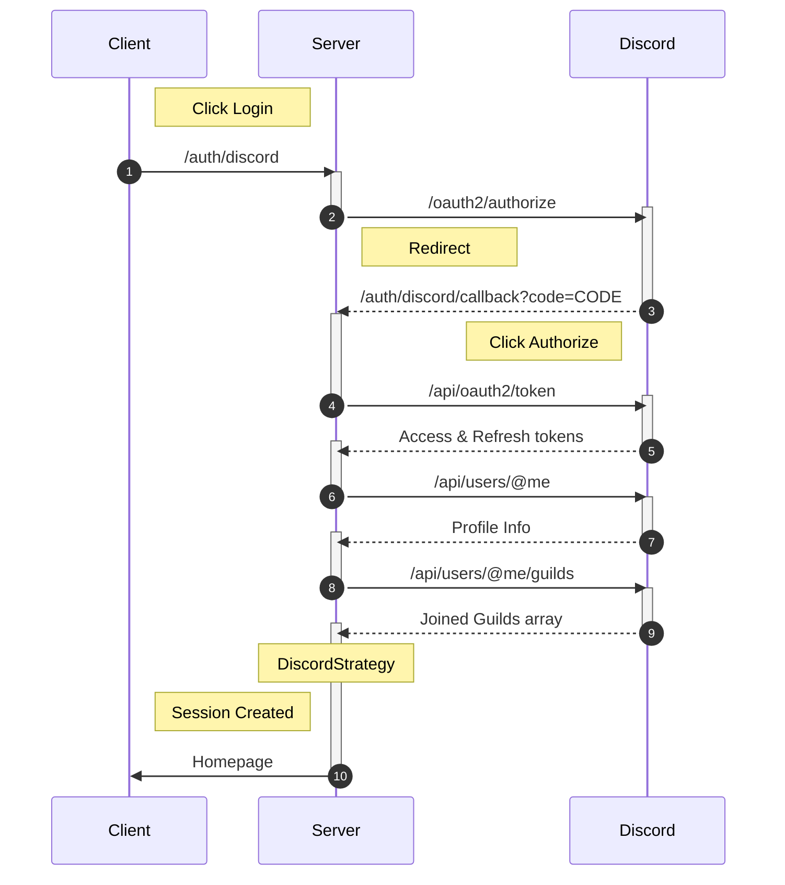
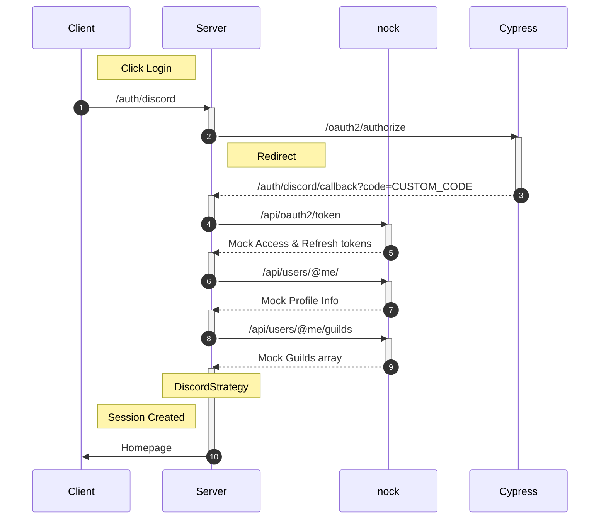

# Testing

### Summary

We utilize testing to aid in the review process. Cypress is used for the code coverage, and Nock for intercepting Discord OAuth2 requests.

### Setup and Configuration

After forking Together and pulling it into your local dev environment, testing is ready right after `npm install` is executed. To run a test you have two options `npm run test-frontend` or `npm run dev-frontend-tests` the main difference being `dev-frontend-tests` allows you to view Together as the test is running to debug any issues.

executing `test-frontend` will start the tests immediately. `dev-frontend-test` require some simple but additional setup. To utilize `dev-frontend-test`

- Execute `npm run dev-frontend-test`
- Select E2E testing
- Select a preferred browser
- Run specs

### How Mocking Works

Mocking is necessary for testing because we need a way to send and receive data to mimic OAuth2. Here is a diagram of how Together uses Discord's OAuth2 login in production:

The most crucial difference is that running the server in `test` mode is request made to the real Disord API will be intercepted by `nock` and mocked with appropriate responses. Testing environment diagram is shown below. For more information on mocking please checkout [@RascalTwo's PR for testing](https://github.com/Caleb-Cohen/Together/pull/319)

### File Explanations

Utilizing Cypress has a brought in a fair bit of new files. Here's an explanation on their purposes.

- [`cypress.config.js`](https://github.com/RascalTwo/Together/blob/13a12608feda04d7599e2a996490af594f6d945d/cypress.config.js.js)
  - Mostly the configuration for Cypress, including the base URL, some flags, and custom task functions.
  - `clearDatabase`
    - Clears the connected MongoDB database.
  - `createEvent`
    - Creates a new Event document.
  - `generateObjectId`
    - Generates a new ObjectId.
- `cypress`
  - `videos` & `screenshots`
    - Videos & screenshots that are generated when running the tests, are ignored by git.
  - `support`
    - [`e2e.js`](https://github.com/RascalTwo/Together/blob/13a12608feda04d7599e2a996490af594f6d945d/cypress/support/e2e.js)
      - Imports the code-coverage logic, and custom commands, and adds a custom `beforeEach` hook to reset the database before each test and visit the homepage.
    - [`functions.js`](https://github.com/RascalTwo/Together/blob/13a12608feda04d7599e2a996490af594f6d945d/cypress/support/functions.js)
      - Helper functions, mostly for dealing with dates.
    - [`commands.js`](https://github.com/RascalTwo/Together/blob/13a12608feda04d7599e2a996490af594f6d945d/cypress/support/commands.js)
      - `login`
        - Login to the backend using the provided user code.
      - `createOwnEvents`
        - Create a number of events for the user code provided.
    - [`tgt.js`](https://github.com/RascalTwo/Together/blob/13a12608feda04d7599e2a996490af594f6d945d/cypress/support/tgt.js)
      - A collection of component-scoped actions & queries for Together as a whole.
      - This makes the actual tests more readable, additionally allowing for any updates to a single component in the future to be made in one place.
  - `e2e`
    - [`auth.cy.js`](https://github.com/RascalTwo/Together/blob/13a12608feda04d7599e2a996490af594f6d945d/cypress/e2e/auth.cy.js)
      - 100Dev members can log in and come back
      - Outsiders aren't logged in and are shown a rejection
      - All login/logout buttons work
    - [`landing.cy.js`](https://github.com/RascalTwo/Together/blob/13a12608feda04d7599e2a996490af594f6d945d/cypress/e2e/landing.cy.js)
      - Links
      - Hamburger menu
    - [`calendar.cy.js`](https://github.com/RascalTwo/Together/blob/13a12608feda04d7599e2a996490af594f6d945d/cypress/e2e/calendar.cy.js)
      - Links
      - Accessible via the calendar button
      - Guest users can't create events
      - Current day is highlighted
      - Month is changeable via buttons & scrolling
      - Only shows events for the current month
    - [`view-event-modal.cy.js`](https://github.com/RascalTwo/Together/blob/13a12608feda04d7599e2a996490af594f6d945d/cypress/e2e/view-event-modal.cy.js)
      - Event models are shown when clicking on an event
      - Non-authors of events can't see the delete buttons
      - Authors can delete individual & all recurring events
    - [`create-event-form.cy.js`](https://github.com/RascalTwo/Together/blob/13a12608feda04d7599e2a996490af594f6d945d/cypress/e2e/create-event-form.cy.js)
      - The event creation form is accessible and prevents any invalid submissions
      - The expected network requests are made to the backend
      - Created events are instantly shown on the calendar
