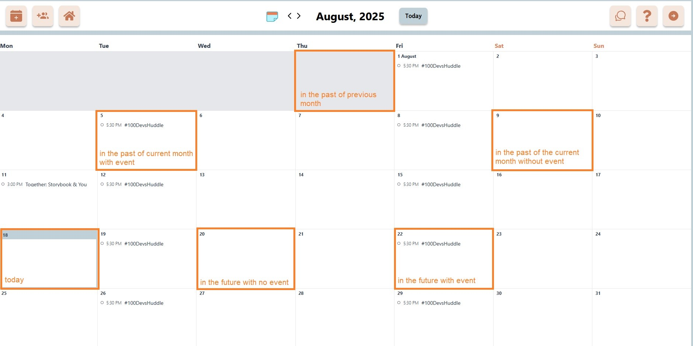
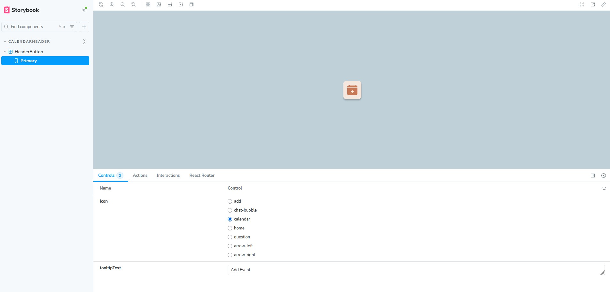

# Storybook

Storybook is a tool for viewing and developing UI components in isolation. It's useful for previewing component states, styling, and behavior without running the full application.

[Storybook Docs](https://storybook.js.org/docs/writing-stories)

## Running Storybook Locally

1. Open your terminal and navigate to the `client` directory:
   `cd client`
2. Install dependencies (if not already installed):
   `npm install`
3. Start Storybook:
   `npm run storybook`
4. Open [ http://localhost:6006](http://localhost:6006) in your browser.

Storybook will launch and show a list of available components and their stories (examples of different states and uses).

## How to Write a Story

This guide will only focus on creating a `Default` story for a component. Storybook has the [ability to create and edit stories](https://storybook.js.org/docs/essentials/controls#creating-and-editing-stories-from-controls) from existing stories.

### 1. Create a story next to the component.

```md
client/
└── src/features/
└── calendarHeader/components
├── HeaderButton.jsx
├── HeaderButton.stories.js ← this is the story file
```

The file name should be the same as the component, except with the `stories.jsx` extension.

### 2. Copy and paste this template code into your new story file.

```jsx
// More on how to set up stories at: https://storybook.js.org/docs/writing-stories#default-export
export default {
  title: "Example/Button",
  component: Button,
  parameters: {
    // Optional parameter to center the component in the Canvas. More info: https://storybook.js.org/docs/configure/story-layout
    layout: "centered",
  },
  argTypes: {},
};

export const Default = {
  args: {},
};
```

Feel free to check out the resources in the comments. Make sure to remove them for the final file.

### 3. Update the basic pieces of the story.

```jsx
// 1. Import the actual component here.
// Example: import {HeaderButton} from "./HeaderButton"

export default {
  // 2. Update the title to the component's location. This is how it will appear in the Storybook sidebar.
  // Example: HeaderButton is used in CalendarHeader, so the title should be CalendarHeader/HeaderButton
  title: "Example/Button",
  // 3. Update the component to the actual component.
  // Example: This should be HeaderButton in our example.
  component: Button,
  parameters: {
    layout: "centered",
  },
  argTypes: {},
};

export const Default = {
  args: {},
};
```

This is what the example `HeaderButton.stories.jsx` looks like without the comments:

```jsx
import HeaderButton from "./HeaderButton";

export default {
  title: "CalendarHeader/HeaderButton",
  component: HeaderButton,
  parameters: {
    layout: "centered",
  },
  argTypes: {},
};

export const Default = {
  args: {},
};
```

### 4. Add `argTypes` and `args`.

In Storybook, `argTypes` specify the behavior of `args`, and `args` are the props passed that define how the component should render. More on them in the Storybook docs: [`argTypes`](https://storybook.js.org/docs/api/arg-types) and [`args`](https://storybook.js.org/docs/writing-stories/args). [Here's a helpful list](https://storybook.js.org/docs/essentials/controls#annotation) of the types of `control` you can have for `argTypes`.

Both of these are going to be different for each component.

A good place to start is to look at the `props` that the component accepts.

```jsx
// HeaderButton.jsx

// Accepts Icon, tooltipText, and rest
function HeaderButton({ Icon, tooltipText, ...rest }) {
  return (
    <button
      className="p-2 sm:p-3 relative bg-[#F5E7DE] shadow-[0_4px_4px_0_rgba(0,0,0,0.25)] rounded-lg group font-inconsolata font-bold cursor-pointer"
      {...rest}
    >
      <Icon className="max-[380px]:w-4 max-[380px]:h-4 w-6 h-6 sm:w-8 sm:h-8 text-[#C57756]" />
      <span className="absolute -bottom-full left-1/2 -translate-x-1/2 opacity-0 group-hover:opacity-100 transition-opacity duration-200 ease-in bg-[#F5CEB5BF] p-2 border border-black whitespace-nowrap rounded-md pointer-events-none z-10">
        {tooltipText}
      </span>
    </button>
  );
}
export default HeaderButton;
```

In the story, we can use this as the `argTypes`.

```jsx
// Imported icons for Icon in argTypes
import { MdGroupAdd } from "react-icons/md";
import { IoChatbubblesOutline } from "react-icons/io5";
import { BsCalendarPlusFill } from "react-icons/bs";
import { FaHome, FaQuestion } from "react-icons/fa";
import { RiArrowLeftCircleFill, RiArrowRightCircleFill } from "react-icons/ri";

import HeaderButton from "./HeaderButton";

// Simple helper map from icon name to icon image source
const ICONS = {
  add: MdGroupAdd,
  "chat-bubble": IoChatbubblesOutline,
  calendar: BsCalendarPlusFill,
  home: FaHome,
  question: FaQuestion,
  "arrow-left": RiArrowLeftCircleFill,
  "arrow-right": RiArrowRightCircleFill,
};

export default {
  title: "CalendarHeader/HeaderButton",
  component: HeaderButton,
  parameters: {
    layout: "centered",
  },
  argTypes: {
    // The tooltipText prop of HeaderButton is a string, so we'll use a text input.
    tooltipText: {
      control: "text",
      description: "Tooltip text",
    },
    // The Icon prop of HeaderButton is an IconType (from react-icons),
    // so this is a fancy way to list some of them from ICONS.
    Icon: {
      control: "radio",
      description: "Icon to display",
      options: Object.keys(ICONS),
      mapping: ICONS,
    },
  },
};

export const Default = {
  args: {},
};
```

Then update the `args` for the `Default` story with some default values.

```jsx
export const Default = {
  args: {
    Icon: ICONS.calendar,
    tooltipText: "Add Event",
  },
};
```

Other than variations, you can also use different states of the component to create `argTypes`.



### 5. Check the story in the Storybook UI.

When you run Storybook locally, you should see your story in the sidebar.

Clicking on it should show the story you just written.



You should be able to manipulate the controls to render different states and variations of the component.
