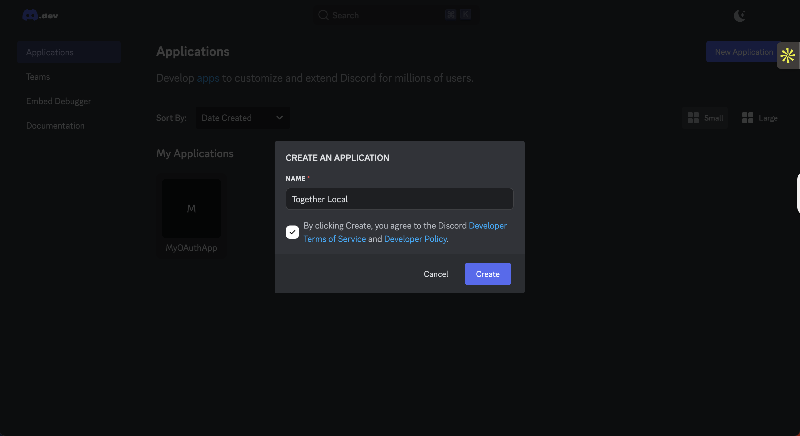

# New Developer Onboarding 

Welcome to Together! We're excited to have you and hope you'll find these resources helpful. If at any point there is some confusion, feel free to reach out to Eric or Caleb on Discord or join the [100Devs thread.](https://discord.com/channels/735923219315425401/1038482732633825442)

## Onboarding resources:

## Engineer Team Introduction

Together is designed not only to create a product that provides value but to be an opportunity for learning and group experience. Together is open to all varying skill sets and encourages peer programming. Get started by following the instructions below and finding an issue that interests you! 

Once you've completed all the tasks below, please join us in Discord. We collaborate from the 100Devs discord and have a [group thread.](https://discord.com/channels/735923219315425401/1038482732633825442)

## Tools, Accounts & Downloads
- <a href="https://github.com/join" target="_blank">GitHub account</a>
- Git installed and setup. Guide for [Mac](https://www.youtube.com/watch?v=hMEyBtsuAJE) & [Windows](https://www.youtube.com/watch?v=2j7fD92g-gE)
- [Visual Studio Code](https://code.visualstudio.com/)
- [Discord](https://discord.com/) & Joined [100 Devs](https://discord.gg/100devs)
- [Compass **(Recommended)**](https://www.mongodb.com/products/compass) or similar MongoDB GUI if using `mongodb://127.0.0.1:27017/` as your DB_STRING
- [MongoDB Account: **(Optional)**](https://www.mongodb.com/) Only required if not using Compass. You will need to change your DB_STRING `mongodb://127.0.0.1:27017/` as your DB_STRING (see [below](#env-template-setup))
- [NodeJS](https://nodejs.org/en/download/)
  - Together utilizes version 22.14.0. [fnm](https://github.com/Schniz/fnm) is a nice package for switching between versions.

## Prerequisites 

Anyone is welcome to join Together. If you're a beginner, we ask that you review the documents below before joining an issue. The React Scrimba Course does not need to be completed, but having a basic understanding of React is heavily recommended. 

- [Git & GitHub Crash Course](https://www.youtube.com/watch?v=SWYqp7iY_Tc)
- [Completed Microsoft Introduction to Github](https://learn.microsoft.com/en-us/training/modules/introduction-to-github/?eventId=LearnwithLeonstream_ggNxpTZxIzb_&ocid=aid3038567)
- [Read the Contributing Documents](https://github.com/Together-100Devs/Together/blob/main/.github/CONTRIBUTING.md)
- [React Scrimba Course](https://scrimba.com/learn/learnreact)

## Development Machine Setup
- Fork the Together repo [(See contributing instructions.)](https://github.com/Together-100Devs/Together/wiki/04-Contributing)
- Clone the forked repository to your local computer. [(See contributing instructions.)](https://github.com/Together-100Devs/Together/wiki/04-Contributing)
- Complete and store `.env` file in the `server/config` folder
- Execute `node -v` and ensure you're on version 22.14.0. You can utilize [fnm](https://github.com/Schniz/fnm) to utilize 22.14.0. 
- Execute `npm install` in the root folder.
- `npm run dev-concurrent` in the root folder. This starts the front-end and back-end in one terminal.

### .env template setup

*Please copy and paste this template into a new .env file instead of removing .example from the `server/` folder*

Keeping `DB_STRING` as `mongodb://127.0.0.1:27017/` will generate an instanced MongoDB in your local. To view your database, you can use <a href="https://www.mongodb.com/products/compass" target="_blank">compass</a>. You can also create a [MongoDB database](https://www.mongodb.com/basics/create-database#:~:text=In%20MongoDB%20Compass%2C%20you%20create,Click%20%22Create%20Database%22) on [MongoDB.com](https://www.mongodb.com/), but would need to update the `DB_String` to [connect to MongoDB.](https://www.mongodb.com/docs/compass/current/connect/)


<!-- saving this for future edit. allows users to use their own discord. http://localhost:2121/auth/discord/callback -->
```
# Please copy and paste this template into a new .env file instead of removing .example from the file name
# Do not change PORT or OAUTH_REDIRECT_URL
# DB_STRING will create a MongoDB instance on your computer but can be changed to a mongodb.com cluster
PORT = 2121
DEV_DB_STRING=mongodb://127.0.0.1:27017/
DB_STRING = mongodb://127.0.0.1:27017/
DISCORD_CLIENT_ID = 1039303417199345684
DISCORD_CLIENT_SECRET = DISCORD_CLIENT_SECRET
OAUTH_REDIRECT_URL = http://localhost:3000/
MOCK_USER=true
NODE_ENV=development
ESLINT_NO_DEV_ERRORS=true
```
**Update**: 
This currently does not work as expected. If you need to test a user, you will need to ask for keys or skip to below on how to set up your own.  
*`DISCORD_CLIENT_SECRET` is not required unless you need to test the discord login. `MOCK_USER=true` and `NODE_ENV=development` allow Together to generate a fake user `testuser#1234` for development purposes. If you need `DISCORD_CLIENT_SECRET`, contact Eric, Dylan, or Emme.*


It is not recommended for beginners, but you can create your own `DISCORD_CLIENT_ID` and `DISCORD_CLIENT_SECRET` by going to [Discord Developer Portal](https://discord.com/developers/docs/intro). 

Under **OAuth2**
* Set up Client Id and Client Secret
* Set the Redirects to `http://localhost:2121/api/auth/discord/callback`. 
* Update .env to:
```
PORT=2121
DB_STRING=mongodb://127.0.0.1:27017/
DISCORD_CLIENT_ID=YOUR ID
DISCORD_CLIENT_SECRET=YOUR SECRET
OAUTH_REDIRECT_URL=http://localhost:3000/
MOCK_USER=false
NODE_ENV=development
```

**To start the Test Event API, execute this command:**

- `npm run dev-concurrent`

<!--
| Doc | Overview |
|--|--|
| [Engineering Team Introduction](./01-engineering-team-intro.md) | A brief introduction |
| [Tools](./02-tools.md) | Tools you will need to install on your machine |
| [Development Machine Setup](./03-development-machine-setup.md) | Development machine setup for this project |
| [Accounts](./04-accounts.md) | Accounts you will need access to |
-->

To run the app locally with Discord authentication, you'll need your own Discord OAuth credentials. Follow the steps below to create a Discord app and configure it for local development. **You do not need to message an admin for a client secret.**

Test: Discord setup instructions in progress

### 1. Create a New Discord Application

- Visit the [Discord Developer Portal](https://discord.com/developers/applications).
- Click **"New Application"**.
- Name your application (e.g., `Together Local`) and click **"Create"**.



### 2. Configure OAuth2

- In your newly created app, go to the **OAuth2** tab.
- Scroll down to **Redirects** and add this URL:

- Click **Save Changes**.


### 3. Retrieve Your Credentials

- Go to the **General Information** tab.
- Copy your **Client ID** and **Client Secret**.


### 4. Update Your `.env` File

Create or update your `.env` file (in the root or `server/` folder):

DISCORD_CLIENT_ID=your_client_id_here
DISCORD_CLIENT_SECRET=your_client_secret_here


> 💡 Make sure `.env` is listed in `.gitignore`.

### 5. Run the App

```bash
npm run dev-concurrent

Visit http://localhost:3000 to test Discord login locally!


